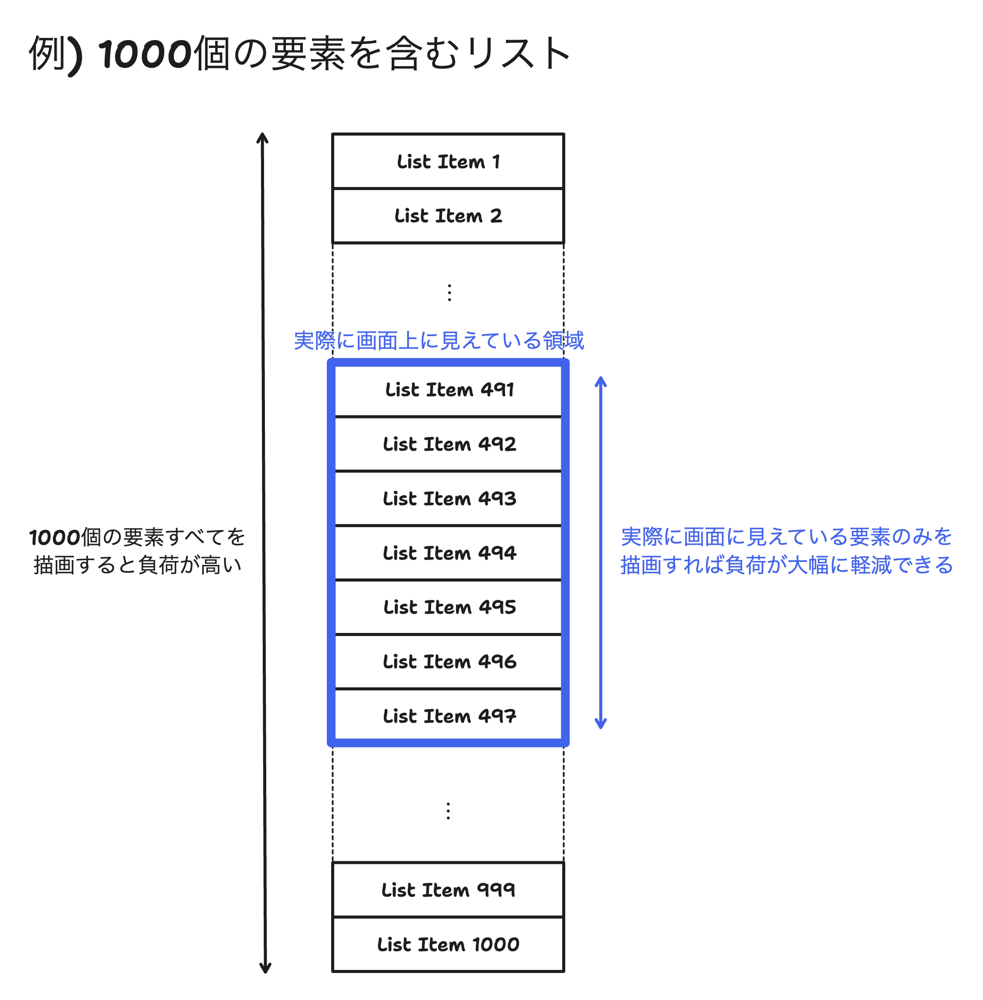

# 仮想リストUI

非常に多くの要素を含む、長いスクロール領域を持ったUIは描画処理に時間がかかる。

実際に画面上に見えている要素だけを描画することで、パフォーマンスを大幅に向上させることができる。

このリポジトリでは、[React](https://react.dev/)での仮想リストの実装方法について検討する。

> [!WARNING]
> このリポジトリはあくまで内部技術に興味がある人向けの検証用リポジトリです。
> 
> 業務等で使用する実用的な仮想リストの実装を求めている場合は既存のライブラリを当たってください。

## 内容

1. [普通のリストUI](doc/01-setup/README.md)
2. [固定サイズ要素の仮想化](doc/02-virtualize-fix-sized-rows/README.md)
3. [バッファリング](doc/03-buffering/README.md)
4. [スクロール処理のオーバーライド](doc/04-scroll-override/README.md)
5. [状態の切り出しとテスト](doc/05-state-and-test/README.md)
6. [Viewportのリサイズへの対応](doc/06-viewport-resize/README.md)
7. [行のリサイズへの対応](doc/07-row-resize/README.md)