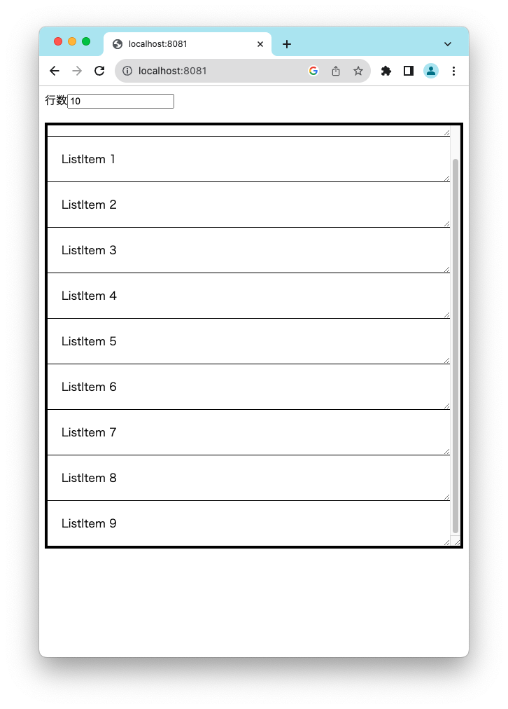
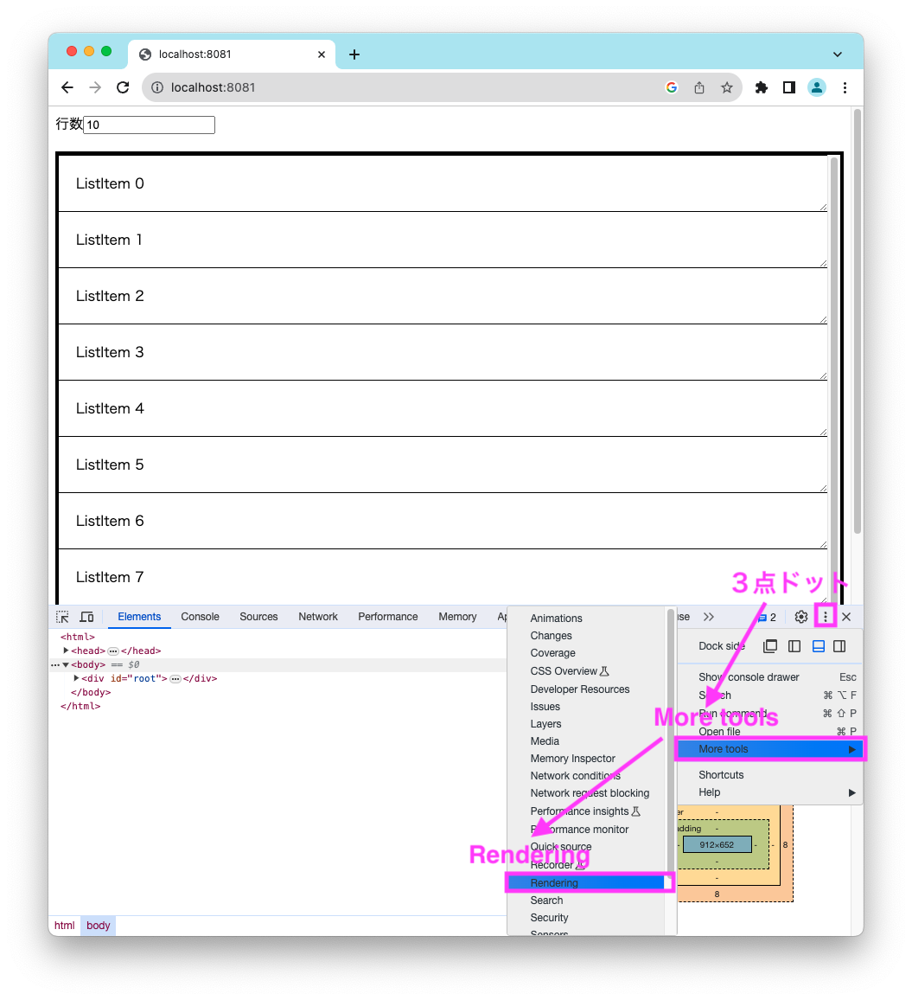
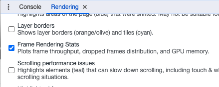
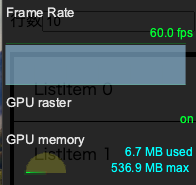
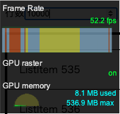

# 1. 普通のリストUI

[この章までのコード例](https://github.com/Kiikurage/VirtualList/tree/01-setup/src)

まず、仮想化されていないリスト、つまり全ての要素を描画する「普通のリストUI」をつくる。



パフォーマンスの検証がしやすいよう、リストの要素数を指定可能にした。 
また、右下のつまみをドラッグして各行およびリストの表示範囲をリサイズできるようにした。
これはCSSの[resize](https://developer.mozilla.org/ja/docs/Web/CSS/resize)プロパティによる。

```typescript jsx
<ul
    style={{
        height: '600px',  // デフォルトの高さ
        overflow: 'auto', // デフォルトだとここが"visible"になっており、この場合resizeが効かない
        resize: 'both', // リサイズ方向。縦横どちらにも。
    }}
>
    {rowNodes}
</ul>
```

## パフォーマンスの確認

自分の環境の場合行数が100行程度であれば問題なくすべての要素が描画でき、パフォーマンス面の問題も見当たらなかった。
一方、行数が増えると初期化時に画面が一瞬固まり、スクロール時も描画が遅れ画面がちらつくなどした。

<div><video controls src="https://github.com/Kiikurage/VirtualList/assets/3253117/30e6cc7e-ffcd-44e6-bfcc-8745ebd9b35d" muted="false"></video></div>

このことはフレームレートでも確認できる。 [Chrome DevToolのRenderingメニューからFrame Rendering Statsを有効化する](https://developer.chrome.com/docs/devtools/rendering/performance/#frame-rendering-stats)。





10行の場合、問題なく60FPS出ていることがわかる。青一色のタイムラインは、どのフレームも欠けていないことを表している。



一方、10000行の場合、FPSは出ているがタイムラインに黄色や赤色の「描画未完了」フレームがあることがわかる。これが画面のチラツキの正体である。
    

