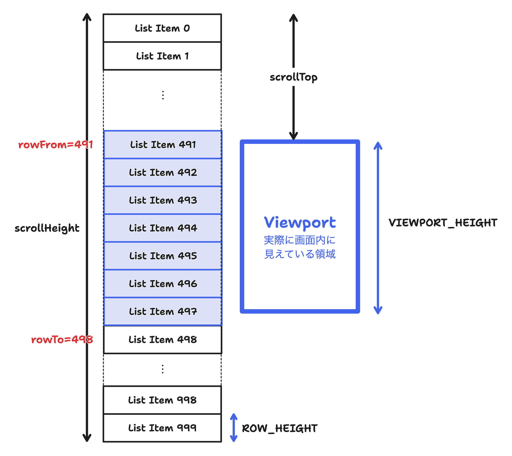
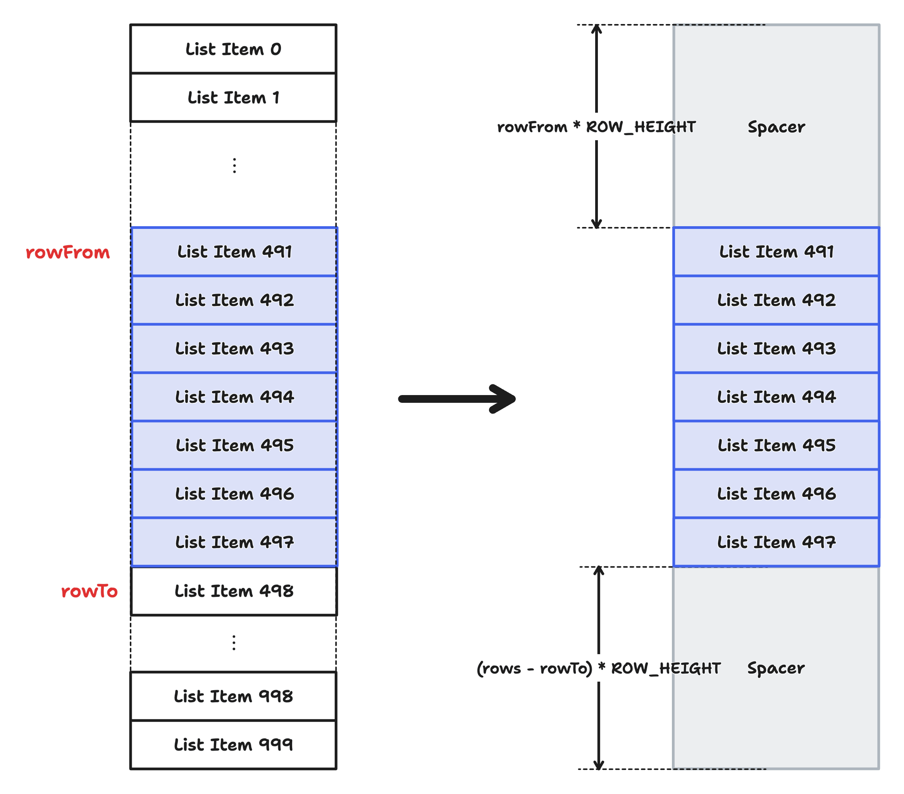
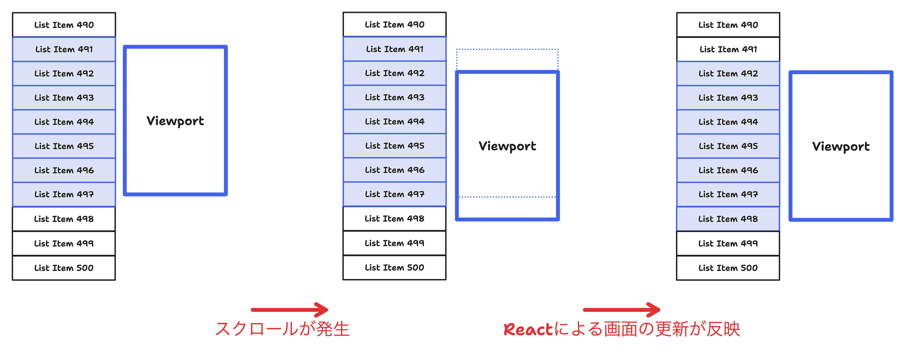

# 2. 固定サイズ要素の仮想化

[この章までのコード例](https://github.com/Kiikurage/VirtualList/tree/02-virtualize-fix-szied-rows/src)

仮想リストで必要最低限の要素のみを描画するには、画面内に見えており描画が必要な要素を特定する必要がある。
例えば以下の図の場合、「491行目から497行目までが画面内に見えており描画が必要である」という情報が必要となる。



問題をシンプルにするために、まずは行の高さを `ROW_HEIGHT`、Viewportの高さを `VIEWPORT_HEIGHT` と固定する。

描画が必要な要素の範囲を `[rowFrom, rowTo)` という半開区間で表す。`rowTo`は「Viewportにぎりぎり表示**されない**行」である点に注意。

> [!TIP]
> 半開区間とは、範囲の片方の端点を含み、もう片方の端点を含まないような範囲の表現方法である。
> プログラム上で範囲を扱うときは、半開区間で表現するとなにかと都合が良いことが多い。

それぞれ、次のように求められる。

```typescript
const rowFrom = Math.max(0, Math.min(Math.floor(scrollTop / ROW_HEIGHT), rows));
const rowTo = Math.max(0, Math.min(Math.ceil((scrollTop + VIEWPORT_HEIGHT) / ROW_HEIGHT), rows));
```

ただし、どちらも次のような式で全体の行数`rows`を超えないようにしている。

```typescript
// 値を指定された範囲内に丸める
const round = (
    value: number, // もとの値
    lowerBound: number, // 下限
    upperBound: number, // 上限
) => Math.max(lowerBound, Math.min(value, upperBound));
```

この範囲内の要素のみを描画すればよい。ただし、画面外の要素を描画しないことでレイアウトが崩れてしまうため、 代わりにダミーの要素(Spacer)を置いておく。



## 描画の遅れ

仮想化後のパフォーマンスを測定してみる。

<div><video controls src="https://github.com/Kiikurage/VirtualList/assets/3253117/4ad7ca11-5582-49ca-bdda-3141eb629312" muted="false"></video></div>

60FPSがしっかりと出ており、フレーム欠けも生じていない一方で、実際の画面ではリストがほとんど表示されていない。

これは、ブラウザのスクロールによる画面更新に、Reactによる仮想リストの更新が間に合っていないためである。



この図では、`List Item 498`がviewport内に入っているがReact側の更新が追いついていない。
