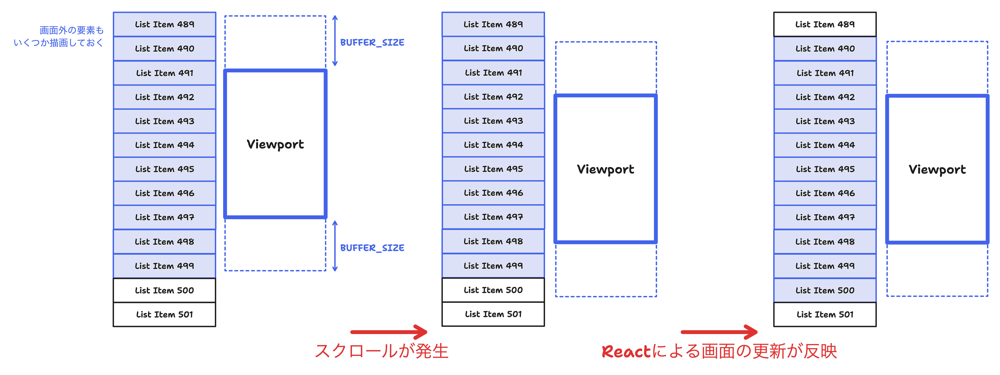

# 3. バッファリング

[この章までのコード例](https://github.com/Kiikurage/VirtualList/tree/03-buffering/src)

仮想リストの更新がブラウザのレンダリング間に合わない問題へのシンプルな解決策としてバッファリングが挙げられる。

これは、予め画面外の要素のいくつかを余裕(バッファ)を持って描画しておく方法である。



この方法は`rowFrom`,`rowTo`の計算時にviewportの大きさをバッファサイズの分大きくとるだけでよいため、
実装が非常に簡単であるという利点がある。

```diff
- const rowFrom = Math.max(0, Math.min(Math.floor(scrollTop / ROW_HEIGHT), rows));
+ const rowFrom = Math.max(0, Math.min(Math.floor((scrollTop - BUFFER_SIZE) / ROW_HEIGHT), rows));

- const rowTo = Math.max(0, Math.min(Math.ceil((scrollTop + VIEWPORT_HEIGHT) / ROW_HEIGHT), rows));
+ const rowTo = Math.max(0, Math.min(Math.ceil((scrollTop + VIEWPORT_HEIGHT + BUFFER_SIZE) / ROW_HEIGHT), rows));
```

## バッファリングの効果

バッファリング後のスクロールの様子は次のようになる。

バッファの範囲内でスクロールした場合、画面はちらつかず次の要素が即座に表示されている。
<div><video controls src="https://github.com/Kiikurage/VirtualList/assets/3253117/56d75a51-5b2e-417c-a042-7e37cabf6f85" muted="false"></video></div>

一方、バッファの範囲を超える大きなスクロールをした場合、次の要素が即座に表示されず画面がちらついてしまう。
<div><video controls src="https://github.com/Kiikurage/VirtualList/assets/3253117/2abdadbe-7dfd-48d9-a647-a1bc115eb958" muted="false"></video></div>

このように、バッファリングはあくまで緩和策であり、 根本的に画面のちらつきを抑えることはできない点に注意が必要である。

- 長所
  - 実装がシンプル
  - 局所的なスクロールには有効
- 短所
  - 広範なスクロールには効果がない