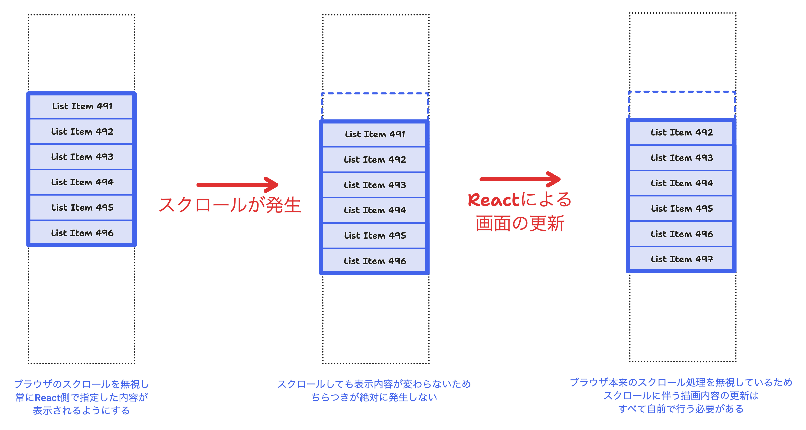
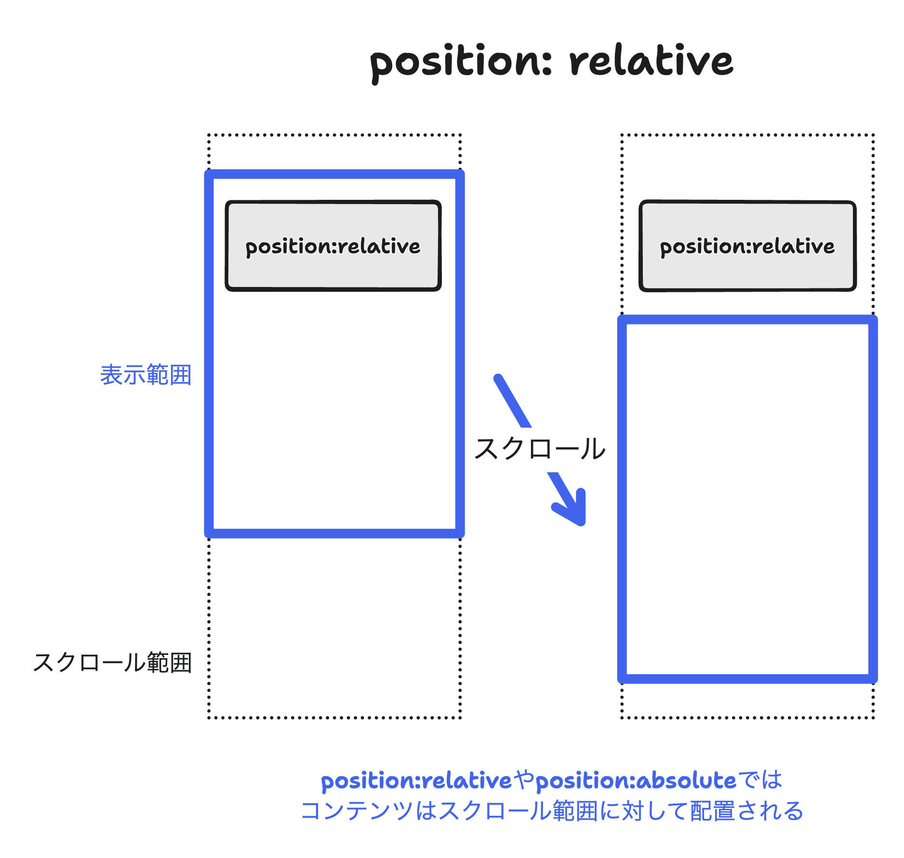
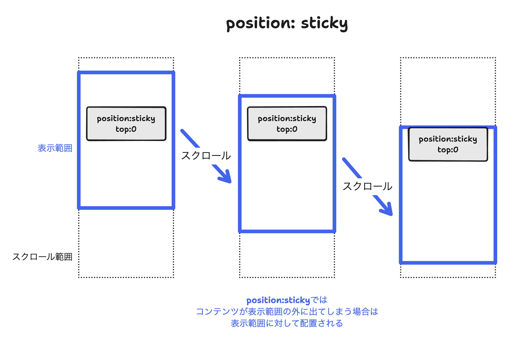

# 4. スクロール処理のオーバーライド

[この章までのコード例](https://github.com/Kiikurage/VirtualList/tree/04-scroll-override/src)

ここまでをまとめると

- **ブラウザのスクロールによる画面更新**に、**Reactによる仮想リストの更新**が間に合わない
- **Reactによる仮想リストの更新**を間に合わせるためにバッファリングを行った
- ブラウザのスクロールが大きすぎる場合はそれでも追いつけない

という流れであった。

そこで、そもそも**ブラウザのスクロールによる画面更新**を無視し、 スクロールによる画面更新をすべて自前で行うことを考える。

## 実装の詳細

スクロールによる要素の移動を無視するために`position: sticky`を使用する [(MDN)](https://developer.mozilla.org/ja/docs/Web/CSS/position#sticky)。

stickyが指定された要素は通常はrelativeと同様スクロール範囲全体に対して配置されるが、
スクロールによって表示範囲外に出てしまう場合には表示範囲に対して配置がされる。

この特性を利用して`top:0, left:0, right:0, bottom:0`をすべて指定することで、
スクロールを無視し常に表示範囲全体に描画され続けるような要素の配置が可能となる。

> [!NOTE]
> ブラウザは通常、スクロール可能なコンテンツ全体のレンダリング結果をキャッシュし、
> 現在のスクロール位置に応じてその一部を切り取って描画している。position:stickyは
> このキャッシュを無効化し、ブラウザに毎フレーム内容を再描画させてしまうため、
> パフォーマンスが低下する可能性が指摘されている。
> 
> これを防ぐために、スクロールする親要素とstickyな子要素とを別レイヤでキャッシュさせる指定が可能である。
> 
> https://developer.mozilla.org/ja/docs/Web/CSS/position#%E3%83%91%E3%83%95%E3%82%A9%E3%83%BC%E3%83%9E%E3%83%B3%E3%82%B9%E3%81%A8%E3%82%A2%E3%82%AF%E3%82%BB%E3%82%B7%E3%83%93%E3%83%AA%E3%83%86%E3%82%A3

一方で、これまでと同様、スクロール領域全体のサイズを確保するためにSpacerも必要となる。

## 結果

前回は描画が追いつかなかった大きなスクロールでも、画面のちらつきが発生していないことがわかる。

<video controls src="https://github.com/Kiikurage/VirtualList/assets/3253117/b72acd92-922f-4e53-bca0-17706f59b24e" muted="false"></video>

